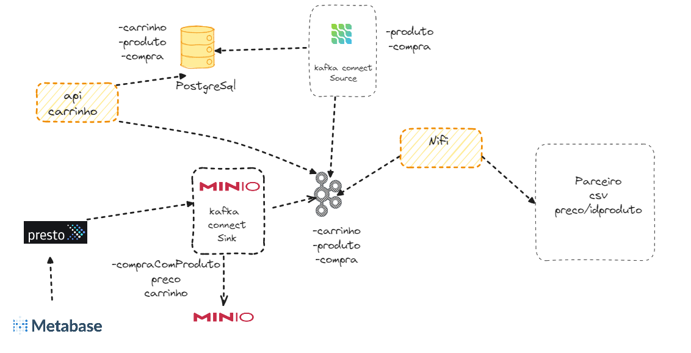

# Lab

## Disclaimer
> **As configurações dos Laboratórios é puramente para fins de desenvolvimento local e estudos**

## 💻 Pré-requisitos
* Docker
* Docker-Compose

A Modas Consultorias, uma empresa especializada em moda e consultoria, está implementando uma funcionalidade em sua aplicação de e-commerce para permitir que os clientes convertam seus carrinhos de compras em pedidos. Além disso, o preço dos produtos será obtido de um parceiro externo que fornece preços atualizados em tempo real.

* Cliente: Usuário que navega na aplicação da Modas Consultorias e adiciona produtos ao carrinho.
* Sistema de E-commerce da Modas Consultorias: Aplicação que gerencia o carrinho de compras e o processo de checkout.
* Parceiro de Preços: Serviço externo que fornece preços atualizados para os produtos.

### Pré-condições:
* 1. O cliente está autenticado no sistema de e-commerce da Modas Consultorias.
* 2. O cliente possui produtos adicionados ao carrinho.
* 3. O sistema de e-commerce está integrado com o serviço de preços do parceiro.

### Fluxo Principal:

* Cliente: Acessa o carrinho de compras.
Sistema de E-commerce da Modas Consultorias: Exibe os produtos adicionados ao carrinho e solicita os preços atualizados ao parceiro de preços.

* Parceiro de Preços: Retorna os preços atualizados dos produtos.
* Cliente: Confirma a compra.
* Sistema de E-commerce da Modas Consultorias: Cria um pedido com base nos produtos do carrinho e nos preços fornecidos pelo parceiro.

1. [Estrutura banco de dados](postgresql/README.md)
2. [Subindo Kafka](kafka/README.md)
3. [Criando os primeiros conectores - Source](conectores/README.md)
4. [Tópico Produto](topico-produto//README.md)
5. [Criando nossa primeira transformação com KSql](transformacao-ksql/README.md)
6. [Criando ambiente MinIO e os Conectores Sink ](minio/README.md)
7. [Criando Api, gerando evento para o carrinho ](api/README.md)
8. [Criando ambiente Analytics - Presto ](presto/README.md)
9. [Criando ambiente Analytics - Criando External tables no Hive](hive/README.md)
10. [Criando ambiente Analytics - Ingestão de Dados Externos com NIFI](nifi/README.md)
11. [Analisando Dados com o metabase](metabase/README.md)

