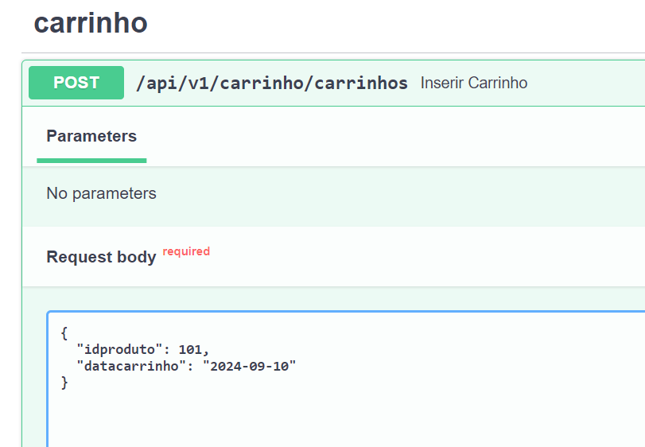

## Disclaimer
> **Esta configuração é puramente para fins de desenvolvimento local e estudos**
> 

---

## Pré-requisitos?
* Docker
* Docker-Compose
* Editor de códigos como VSCode, Sublime, Vim
* Python 3.10
---

## Subindo o API

```bash 

//Excluindo o container caso esteja ativo 
docker container rm  fast-api-fia -f

docker compose up -d api

docker image ls

docker logs  fast-api-fia 

```

# Vamos inserir um registro do carrinho

* http://localhost:8000/docs



## No Arquivo `route/carrinho.py` podemos validar o id do produto, analisando se é válido.
## No Arquivo `route/carrinho.py` podemos inserir uma compra.

## Consumindo mensagens no kafka tópico carrinho


```bash 

docker exec -it kafka-broker /bin/bash

kafka-console-consumer --bootstrap-server localhost:9092 --topic carrinho  --property print.timestamp=true --property print.key=true --property print.value=true --property print.partition=true --from-beginning
```

#### Ir para o Proximo lab:

8. [Criando ambiente Analytics - Presto ](../presto/README.md)
9. [Criando ambiente Analytics - Criando External tables no Hive](../hive/README.md)
10. [Criando ambiente Analytics - Ingestão de Dados Externos com NIFI](../nifi/README.md)
11. [Analisando Dados com o metabase](../metabase/README.md)