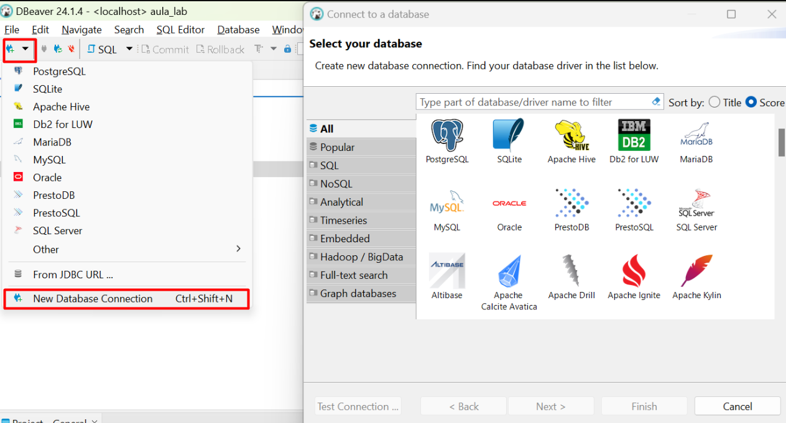

## Disclaimer
> **Esta configuração é puramente para fins de desenvolvimento local e estudos**
> 

---

## Pré-requisitos?
* Docker
* Docker-Compose
* Serviços Hadoop e Hive 

## Open DBeaver
New Database Connection - Apache Hive


Preencha somente
Hostname: localhost
Port:10000


Faça o Test Connection no botão inferior esquerdo 


Abra um novo script conforme imagem abaixo


## Criando database no Hive - raw_topics

```sql
create database if not exists raw_topics location 's3a://raw/topics'
``` 

# Criando as External Tables

### raw_topics.carrinho

```sql
create external table if not exists raw_topics.carrinho(
datacarrinho date, idproduto int, id int
)
PARTITIONED BY (ano string, mes string, dia string)
stored as jsonfile
location 's3a://raw/topics/carrinho';
```
### Rodar o repair para criar as partições
```sql
msck repair table raw_topics.carrinho;

select * from  raw_topics.carrinho;

```


## raw_topics.produtos

```sql
create external table if not exists raw_topics.produtos (
	id bigint,
	nome string,
	valor float
)
PARTITIONED BY (ano string, mes string, dia string)
stored as jsonfile
location 's3a://raw/topics/postgres.dbfiafastapi.produtos';
```
### Rodar o repair para criar as partições
```sql
msck repair table raw_topics.produtos;

select * from  raw_topics.produtos;

```


## raw_topics.compra

```sql
create external table if not exists raw_topics.compra(
	id bigint,
	valortotal float
)
PARTITIONED BY (ano string, mes string, dia string)
stored as jsonfile
location 's3a://raw/topics/postgres.dbfiafastapi.compra';
```
### Rodar o repair para criar as partições
```sql
msck repair table raw_topics.compra;

select * from  raw_topics.compra;

```

## Rodar um select para testes:
```sql
select idproduto,count(*) as total from raw_topics.carrinho
group by  idproduto
order by 2 desc ;
```


#### Ir para o Proximo lab:

10. [Criando ambiente Analytics - Ingestão de Dados Externos com NIFI](../nifi/README.md)


