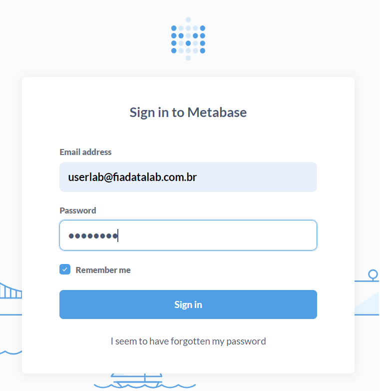
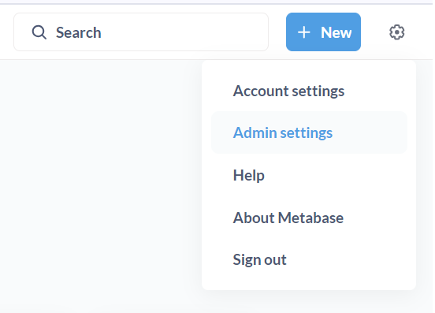
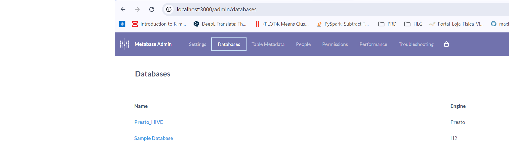
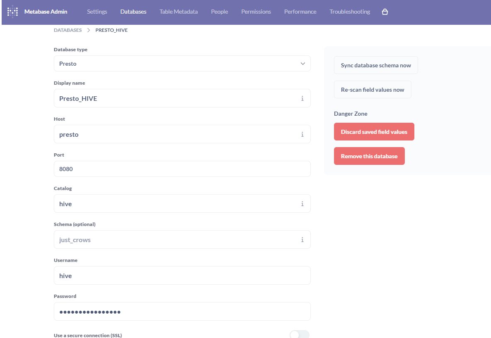
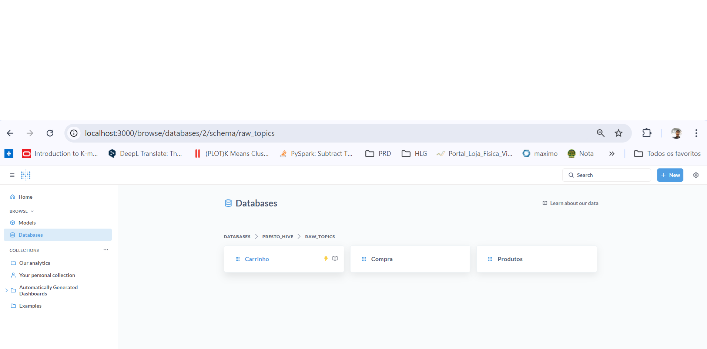
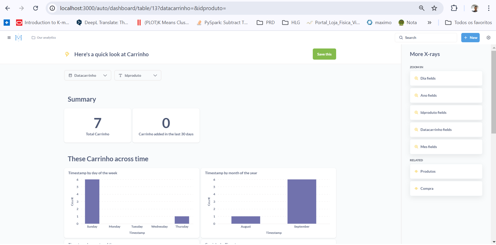

## Disclaimer
> **Esta configuração é puramente para fins de desenvolvimento local e estudos**
> 

---

## 💻 Pré-requisitos
* Docker
* Docker-Compose


## Subindo o Metabase
```bash
docker-compose up -d metabase
```

### Abrir o Metabase
Abra aqui o [Metabase](http://localhost:3000/)


### Logando

#### User:
```bash
userlab@fiadatalab.com.br
```
#### Password:
```bash
datalab
```



### Tela inicial


### Configurando o Presto

Selecione a engranagem ao lado esquerdo da tela e depois click na opcção **Admin settings**:



Acesse a opção **Databases** e caso não tenha Database **Presto_HIVE** clicar **Add Database**   


- Configuração

**Database type**
```bash
Presto
```
**Display name**
```bash
Presto_HIVE
```

**Host**
```bash
presto
```

**Port**
```bash
8080
```

**Catalog**
```bash
hive
```

**Username**
```bash
hive
```


- Após a configuração "Salvar" e sair da configuração Admin.


Criando o dash utilizando X-Ray. Databases > Presto_HIVE > raw_topics



Na tabela Crrinho, clicar no raio para a criação do dsah proposto pelo próprio metabase e divirtan-se!



