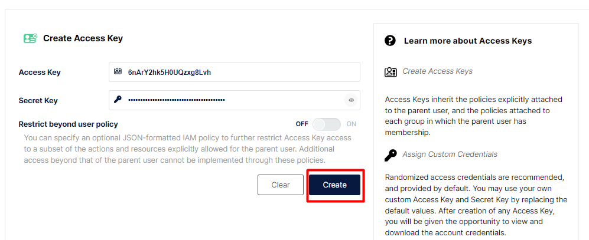

## Disclaimer
> **As configurações dos Laboratórios é puramente para fins de desenvolvimento local e estudos**


## Pré-requisitos?
* Docker
* Docker-Compose


### Subindo o ambiente do MinIO

```bash
docker-compose up -d  minio
```

### Configurando MinIO


Acesso para o MinIO http://localhost:9001/login

* Senha : admin
* password: minioadmin


### Configurando o MinIO





Instalando o conector do MinIO

> [!IMPORTANT]
> Não esqueçam de mudar os campos  `aws.access.key.id` e `aws.secret.access.key` dos arquivos:

 * `conector-minio-carrinho.json`
 * `conector-minio-COMPRASITEMPRODUTO.json `

Criando o conector `conector-minio-carrinho.json`

```bash
http PUT http://localhost:8083/connectors/conector-minio-carrinho.json/config < conector-minio-carrinho.json.json

```

Criando o conector `conector-minio-COMPRASITEMPRODUTO.json`


## AGORA É COM VOCÊ!