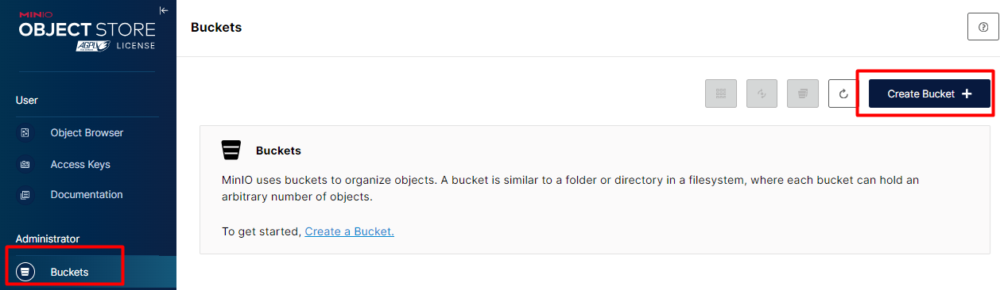
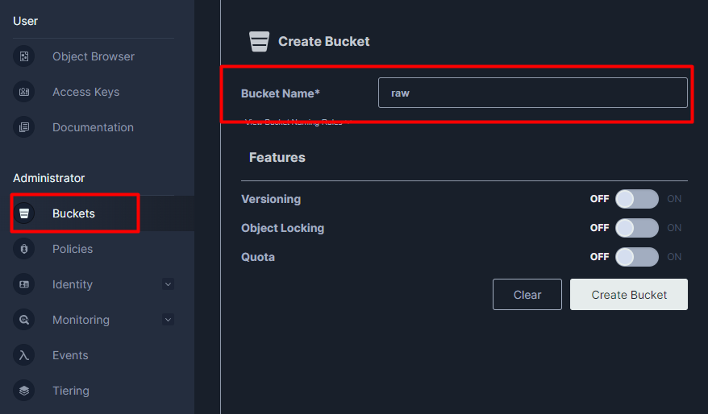
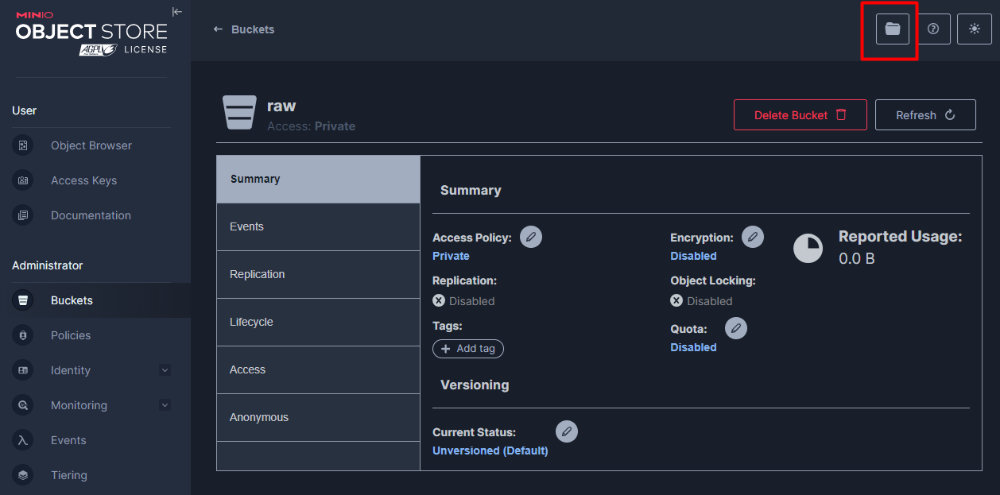
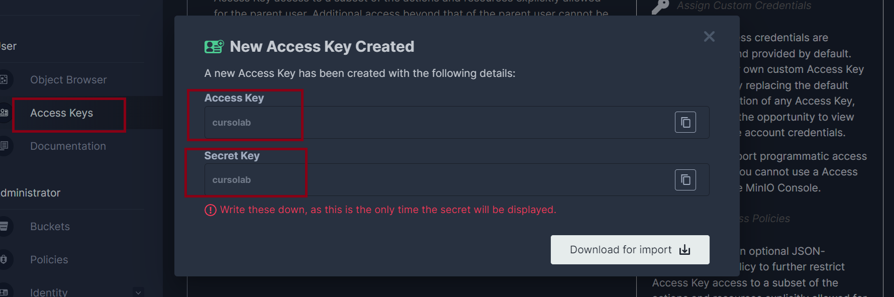

# Lab

## Disclaimer
> **As configurações dos Laboratórios é puramente para fins de desenvolvimento local e estudos**


## Pré-requisitos?
* Docker
* Docker-Compose


### Antes de subir o MinIO, vamos criar o tópico carrinho que será produzido mensagens via api
```bash

docker exec -it kafka-broker /bin/bash

kafka-topics --create --topic carrinho --bootstrap-server localhost:9092 --partitions 1 --replication-factor 1 

kafka-topics --bootstrap-server localhost:9092 --list 
```

### Vamos produzir algumas mensagens

```json

kafka-console-producer --bootstrap-server localhost:9092 --topic carrinho
	
 {"id": 1, "idproduto": 101, "datacarrinho": "2024-08-01"}

```

### Subindo o ambiente do MinIO

```bash
docker-compose up -d  minio
```

### Configurando MinIO


Acesso para o MinIO http://localhost:9001/login

* Senha : admin
* password: minioadmin


### Configurando o MinIO

> [!IMPORTANT]
> Crie a camada Raw caso não tenha ainda







Instalando o conector do MinIO



> [!IMPORTANT]
> Os campos `aws.access.key.id` e `aws.secret.access.key` dos arquivos abaixo,  tem as chaves `cursolab` e `cursolab` que estão configuradas no arquivo `docker-compose.yaml`.

 * `conector-minio-carrinho.json`
 * `conector-minio-COMPRASITEMPRODUTO.json `

Criando o conector `conector-minio-carrinho.json`

```bash
http PUT http://localhost:8083/connectors/conector-minio-carrinho/config < conectores/conector-minio-carrinho.json


//Ou via powershell
$response = Invoke-WebRequest -Uri "http://localhost:8083/connectors/conector-minio-carrinho/config" -Method Put -Body (Get-Content -Path "conectores/conector-minio-carrinho.json" -Raw) -ContentType "application/json"; $response.Content


docker exec -it kafkaConect curl http://localhost:8083/connectors/conector-minio-carrinho/status

```

## Criando o conector `COMPRASITEMPRODUTO`
## Criando o conector `Compra`
## Criando o conector `Produto`


Criando o conector `conector-minio-COMPRASITEMPRODUTO.json`
Criando o conector `conector-minio-compra.json`
Criando o conector `conector-minio-produto.json`


## AGORA É COM VOCÊ!

7. [Criando APi, gerando evento para o carrinho ](../api/README.md)
8. [Criando ambiente Analytics - Presto ](../presto/README.md)
9. [Criando ambiente Analytics - Criando External tables no Hive](../hive/README.md)
10. [Criando ambiente Analytics - Ingestão de Dados Externos com NIFI](../nifi/README.md)
11. [Analisando Dados com o metabase](../metabase/README.md)