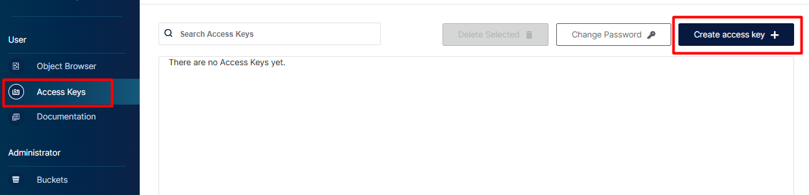
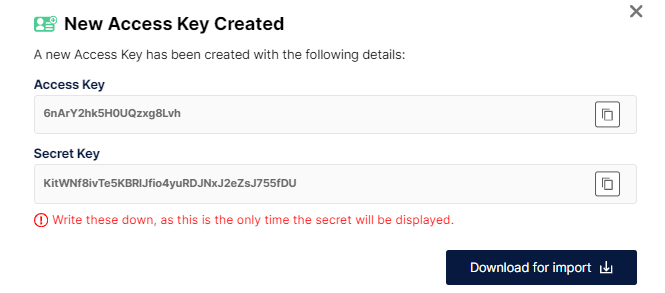

# Lab

## Disclaimer
> **As configurações dos Laboratórios é puramente para fins de desenvolvimento local e estudos**


## Pré-requisitos?
* Docker
* Docker-Compose


### Antes de subir o MinIO, vamos criar o tópico carrinho que será produzido via api
```bash

docker exec -it kafka-broker /bin/bash

kafka-topics --create --topic carrinho --bootstrap-server localhost:9092 --partitions 1 --replication-factor 1 

kafka-topics --bootstrap-server localhost:9092 --list 
```

### Vamos produzir algumas mensagens

```json

kafka-console-producer --bootstrap-server localhost:9092 --topic carrinho
	
 {"id": 1, "idproduto": 101, "datacarrinho": "2024-08-01"}

```

### Subindo o ambiente do MinIO

```bash
docker-compose up -d  minio
```

### Configurando MinIO


Acesso para o MinIO http://localhost:9001/login

* Senha : admin
* password: minioadmin


### Configurando o MinIO






Instalando o conector do MinIO

> [!IMPORTANT]
> Não esqueçam de mudar os campos  `aws.access.key.id` e `aws.secret.access.key` dos arquivos:

 * `conector-minio-carrinho.json`
 * `conector-minio-COMPRASITEMPRODUTO.json `

Criando o conector `conector-minio-carrinho.json`

```bash
http PUT http://localhost:8083/connectors/conector-minio-carrinho/config < conectores/conector-minio-carrinho.json


docker exec -it kafkaConect curl http://localhost:8083/connectors/conector-minio-carrinho/status

```

## Insrida dados na tabela carrinho


Criando o conector `conector-minio-COMPRASITEMPRODUTO.json`


## AGORA É COM VOCÊ!