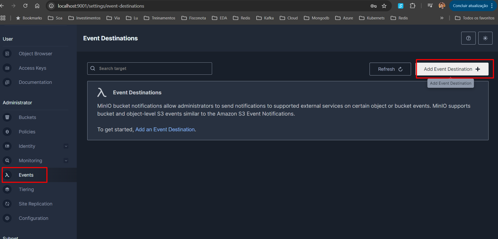
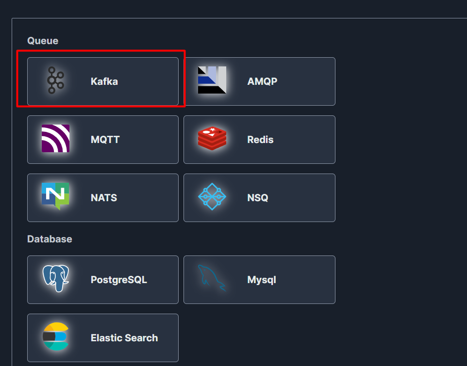
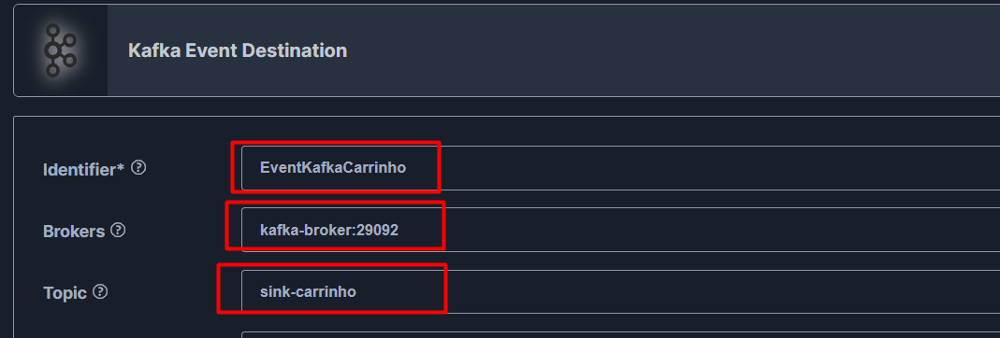
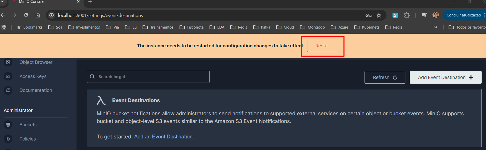
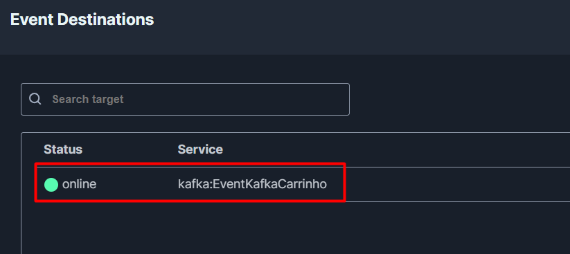
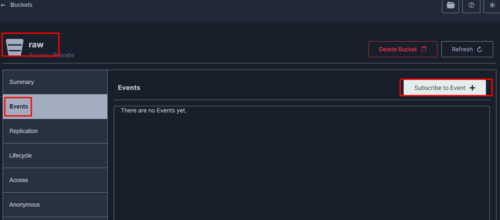
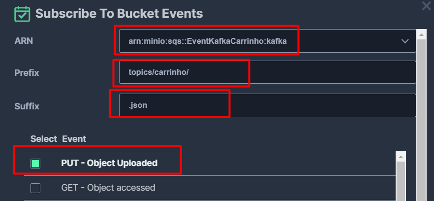

# Lab

## Disclaimer
> **As configurações dos Laboratórios é puramente para fins de desenvolvimento local e estudos**

## 💻 Pré-requisitos
* Docker
* Docker-Compose

### Configurando o Minio para gerar evntos

### Selecione a Queue Kafka

### Informa as seguintes configurações

* Identifier : EventKafkaCarrinho
* Brokers: kafka-broker:29092
* Topic: sink-carrinho

### Renicia o serviço e veja depois se ficou online

### Criando o Subscribe para o bucket raw/topics/carrinho

### Configurando o evento para ser acionado para a pasta topics/carrinho/

* ARN : arn:minio:sqs::EventKafkaCarrinho:kafka
* Prefix: topics/carrinho/
* Suffix: .json

### Publique mensagens para o topico carrinho pelo fastapi

* http://localhost:8000/docs
