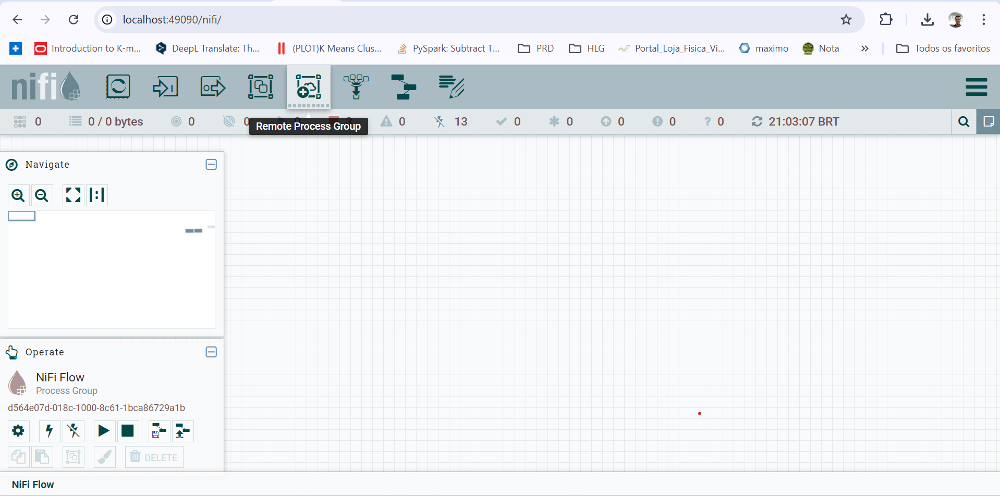
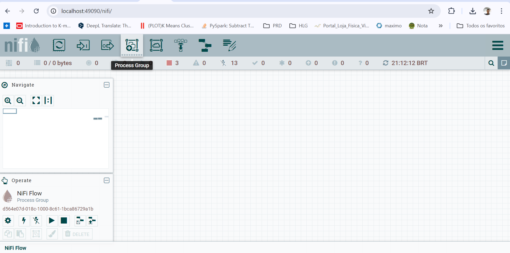
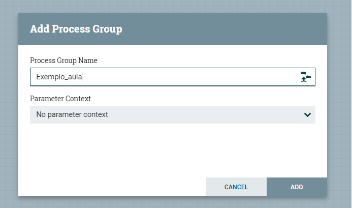
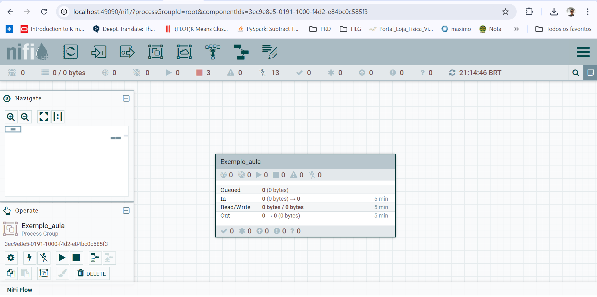
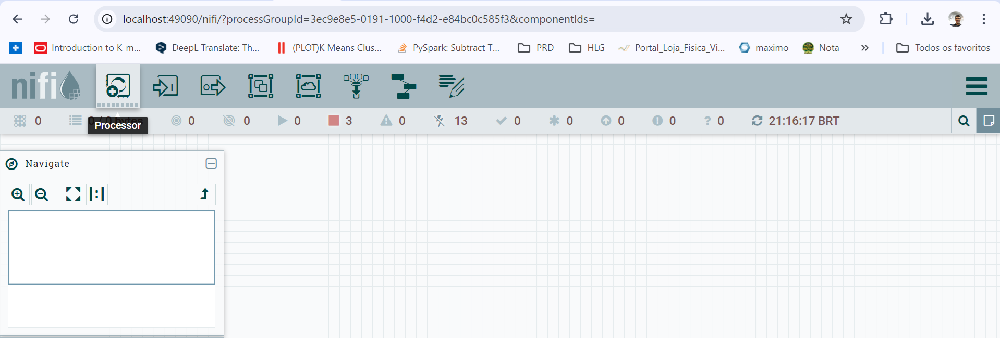
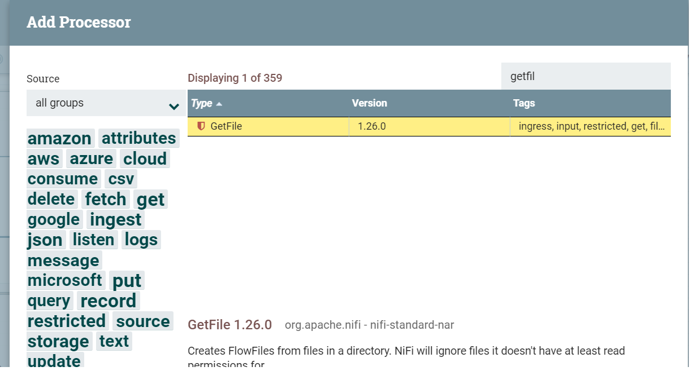
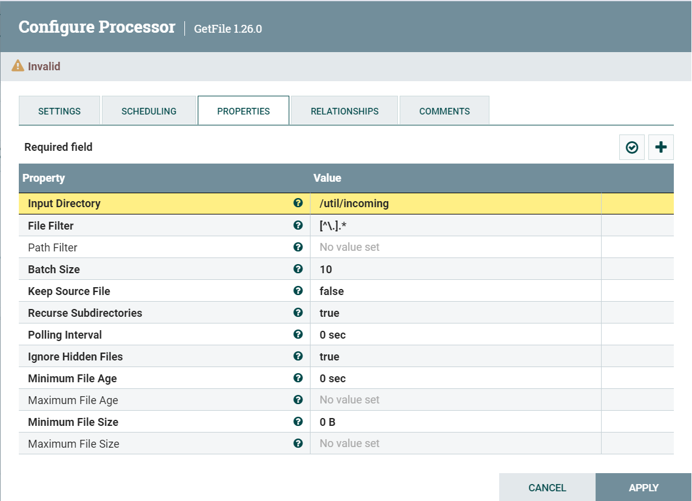
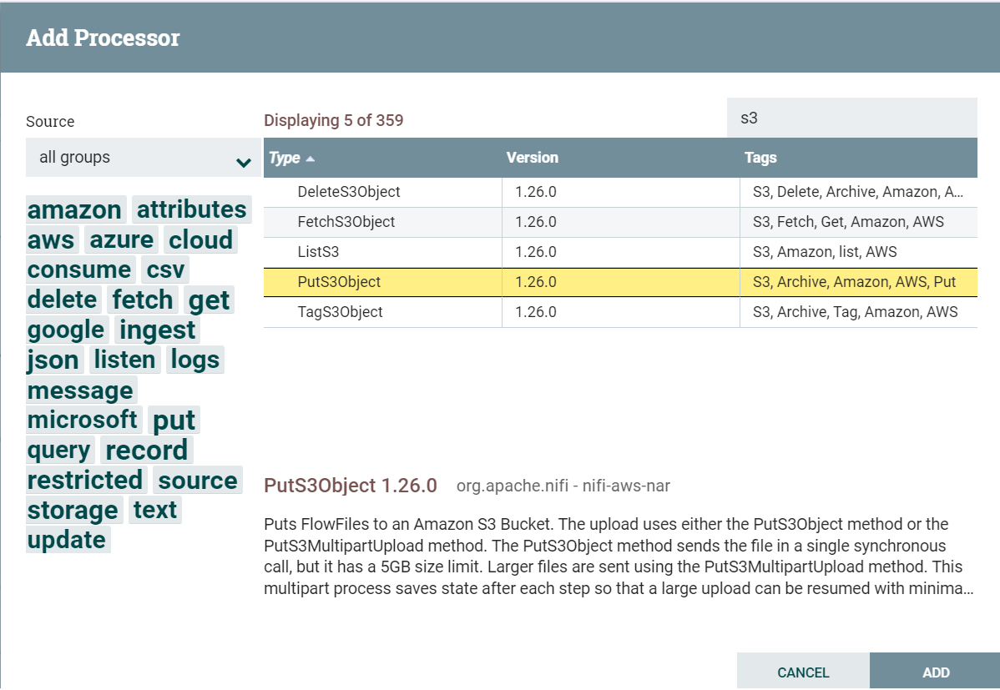
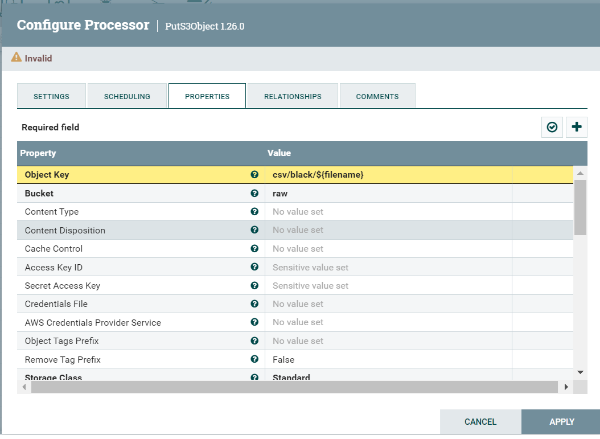
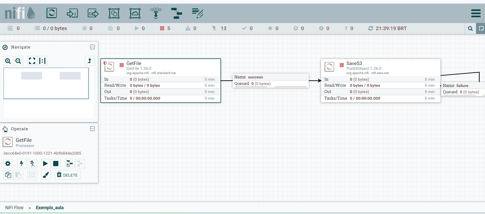

## Disclaimer
> **Esta configuração é puramente para fins de desenvolvimento local e estudos**
> 

---

## 💻 Pré-requisitos
* Docker
* Docker-Compose


> [!IMPORTANT]
> Esse serviço pode demorar alguns minutos para subir, acompanha os logs.


## Subindo o NIFI
```bash
docker compose up -d nifi
```

## Abrir  o NIFI em http://localhost:49090/nifi/

## Tela inicial


## Criando grupo - Exemplo_aula
### Process Group 




## Criando fluxo de ingestão - Exemplo_aula
### Acessar grupo de processamento 


### Criar o processador GetFile - Vai capturar o arquivo csv quando adicionado no diretório



### Selecionar processador GetFile


### Configurando processador acessando PROPERTIES
* Input Directory: /util/incoming
  * Criar path acima na raiz do projeto. 



### Criar fluxo de escrita com o processador - PutS3Object



### Criar fluxo de escrita com o processador - PutS3Object

* Object Key: csv/black/${filename}
* Bucket: raw
* Endpoint Override URL: http://minio:9000
* Access Key ID: cursolab
* Secret Access Key: cursolab



### O Fluxo deve ficar igual abaixo 

> [!IMPORTANT]
> Adicionar os fluxos de falha/sucesso ao terminar no processador S3




Copie o arquivo `BlackFridayDataset2.txt` que está dentro da pasta `util`  e cola na pasta `nifi/util/incoming`


> [!IMPORTANT]
> Voltar para o dbeaver para executar realizar a criação das tabela externa referente ao CSV.

## Criando database no Hive - raw_csv

```sql
create database if not exists raw_csv;
``` 

## Criando as External Tables

### raw_csv.blackfriday

```sql
create external table if not exists raw_csv.blackfriday
(
User_ID int,
Product_ID string,
Gender string,
Age string,
Occupation int,
City_Category string,
Stay_In_Current_City_Years int,
Marital_Status int,
Product_Category_1 int,
Product_Category_2 int,
Product_Category_3 int,
Purchase int
)
row format delimited fields terminated by ','
stored as textfile
location 's3a://raw/csv/black'
tblproperties ("skip.header.line.count"="1");
```


## Testando a ingestão

```sql
select count(*) as total from raw_csv.blackfriday;
```

#### Ir para o Proximo lab:

11. [Analisando Dados com o metabase](../metabase/README.md)


