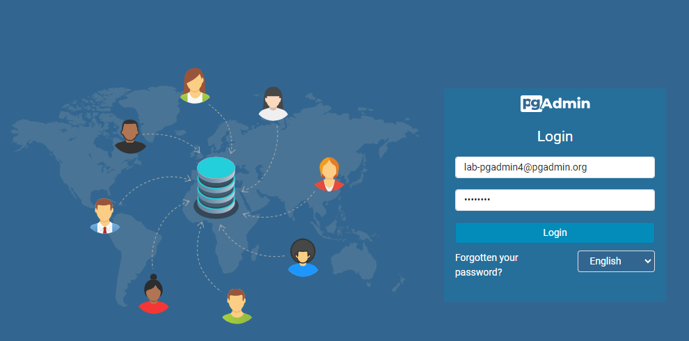
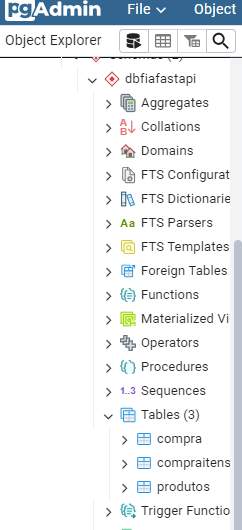

# Lab

## Disclaimer
> **As configurações dos Laboratórios é puramente para fins de desenvolvimento local e estudos**


## Pré-requisitos?
* Docker
* Docker-Compose


### Iniciando o ambiente para o banco de dados

Na pastinha PostegreSql tem o arquivo para a criação da estrutura inicial do banco. 

Observe o arquivo `Dockerfile` e veja que está sendo copiado o arquivo `db.sql` pra dentro da imagem em sua criação.

Nesse arquivo crie a estrutura da tabela `carrinhos` contendo os seguintes campos:

* id SERIAL  NOT NULL PRIMARY KEY
* idProduto integer NOT NULL
* dataCarrinho date NOT NULL   


> [!IMPORTANT]
> Crie os arquivos nas pastas correspondentes


```bash

mkdir .\postgresql\volume\pg_notify
mkdir .\postgresql\volume\pg_tblspc
mkdir .\postgresql\volume\pg_twophase
mkdir .\postgresql\volume\pg_stat
mkdir .\postgresql\volume\pg_logical\mappings
mkdir .\postgresql\volume\pg_commit_ts
mkdir .\postgresql\volume\pg_snapshots
```


Após a criação vamos subir os serviços do docker compose... Lembram!?!!?!?

* postgres  
* pgadmin


```bash
docker-compose up -d postgres  pgadmin 

docker container ls

```

### Conectando o banco PostgreSql com a ferramenta PgAdmin


Acessando para o PgAdmin http://localhost:5433/


* Login: lab-pgadmin4@pgadmin.org
* Senha : postgres    

* Nome do server: postgres
* Nome do Host Name: postgres
* database: admin
* Username: postgres
* password: postgres

### Tela de login do PgAdmin



### Inserindo um server


### Configurando o server


### ...Se tudo deu certo o banco admin com suas tabelas


> [!IMPORTANT]
> Navegam entre as tabelas, façam alguns selects


2. [Subindo Kafka](../kafka/README.md)
3. [Criando os primeiros conectores - Source](../conectores/README.md)
4. [Tópico Produto](../topico-produto//README.md)
5. [Criando nossa primeira transformação com KSql](../transformacao-ksql/README.md)
6. [Criando ambiente MinIO e os Conectores Sink ](../minio/README.md)
7. [Criando APi, gerando evento para o carrinho ](../api/README.md)
8. [Criando ambiente Analytics - Presto ](../presto/README.md)
9. [Criando ambiente Analytics - Criando External tables no Hive](../hive/README.md)
10. [Criando ambiente Analytics - Ingestão de Dados Externos com NIFI](../nifi/README.md)
11. [Analisando Dados com o metabase](../metabase/README.md)