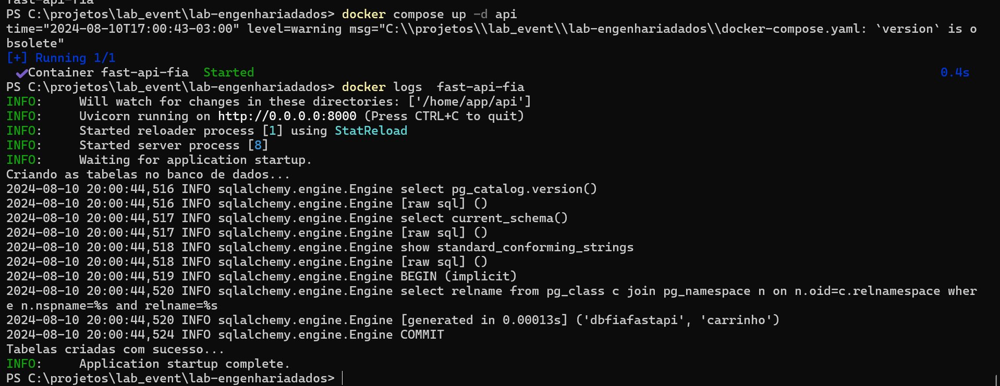

## Disclaimer
> **Esta configuração é puramente para fins de desenvolvimento local e estudos**
> 

---

## Pré-requisitos?
* Docker
* Docker-Compose
* Editor de códigos como VSCode, Sublime, Vim, Notepad++ e etc
* Ter todos os conectores do Lab "Running", abaixo os camandos de verificação/criação:

## connector-postgres
Verificar :
```bash
docker exec -it kafkaConect curl http://localhost:8083/connectors/connector-postgres/status
``` 
Criar:
```bash
$response = Invoke-WebRequest -Uri "http://localhost:8083/connectors/connector-postgres/config" -Method Put -Body (Get-Content -Path "conectores/conector-postgres.json" -Raw) -ContentType "application/json"; $response.Content
``` 

## connector-postgres-produtos
Verificar:
```bash
docker exec -it kafkaConect curl http://localhost:8083/connectors/connector-postgres-produtos/status
``` 
Criar:
```bash
$response = Invoke-WebRequest -Uri "http://localhost:8083/connectors/connector-postgres-produtos/config" -Method Put -Body (Get-Content -Path "conectores/conector-postgres-produto.json" -Raw) -ContentType "application/json"; $response.Content
```

## conector-minio-carrinho
Verificar:
```bash
docker exec -it kafkaConect curl http://localhost:8083/connectors/conector-minio-carrinho/status
``` 
Criar:
```bash
$response = Invoke-WebRequest -Uri "http://localhost:8083/connectors/conector-minio-carrinho/config " -Method Put -Body (Get-Content -Path "conectores/conector-minio-carrinho.json" -Raw) -ContentType "application/json"; $response.Content
```

## conector-minio-comprasitemproduto
Verificar:
```bash
docker exec -it kafkaConect curl http://localhost:8083/connectors/conector-minio-comprasitemproduto/status
``` 
Criar:
```bash
$response = Invoke-WebRequest -Uri "http://localhost:8083/connectors/conector-minio-comprasitemproduto/config " -Method Put -Body (Get-Content -Path "conectores/conector-minio-COMPRASITEMPRODUTO.json" -Raw) -ContentType "application/json"; $response.Content
```

## conector-minio-compra
Verificar:
```bash
docker exec -it kafkaConect curl http://localhost:8083/connectors/conector-minio-compra/status
``` 
Criar:
```bash
$response = Invoke-WebRequest -Uri "http://localhost:8083/connectors/conector-minio-compra/config " -Method Put -Body (Get-Content -Path "conectores/conector-minio-compra.json" -Raw) -ContentType "application/json"; $response.Content  
```

## conector-minio-produto
Verificar:
```bash
docker exec -it kafkaConect curl http://localhost:8083/connectors/conector-minio-produto/status
``` 
Criar:
```bash
$response = Invoke-WebRequest -Uri "http://localhost:8083/connectors/conector-minio-produto/config " -Method Put -Body (Get-Content -Path "conectores/conector-minio-produto.json" -Raw) -ContentType "application/json"; $response.Content  
``` 
---

## Subindo o API

```bash 

docker container rm  fast-api-fia -f

docker-compose up -d api

docker image ls

docker logs  fast-api-fia 

```
Saída do Log - API:



# Subindo o Hadoop

> [!IMPORTANT]
> Antes de subir os serviços, garantir que o user admin (com senha admin) esteja criado no banco postgres utilizado no lab, caso não tenha será necessário criar.

```bash
docker-compose up -d namenode datanode metastore
``` 

# Subindo o Hive

```bash
docker-compose up -d hive
```

# Subindo o Hive

```bash
docker-compose up -d presto
```


#### Ir para o Proximo lab:

9. [Criando ambiente Analytics - Criando External tables no Hive](../hive/README.md)